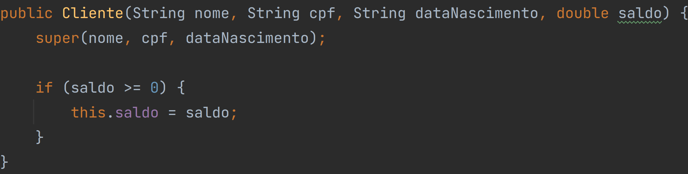

# Herança

    A herança é o <strong>relacionamento</strong> entre classes mais gerais e classes mais específicas.

    O estado e comportamento de uma superclasse é atribuído à subclasse que faz a herança a partir dela.

    Uma classe que herda de uma classe é chamada de subclasse e a classe a partir da qual a herança foi feita é chamada de superclasse.

    A superclasse pode ser direta (Aquela que a subclasse herda e está imediatamente abaixo da superclasse na hierarquia de classes) ou indireta (Aquela que a subclasse herda, mas não estão diretamente ligadas).

    
Exemplo de como estender uma classe:

    

    
Exemplo de como se deve chamar o construtor da superclasse direta:

    

# Como executar?

Antes de executar verifique se o <a href="https://www.oracle.com/java/technologies/downloads/">JDK</a> está instalado em seu computador.
Feito isso, navegue até a pasta src e digite `javac Main.java && java Main` no terminal.